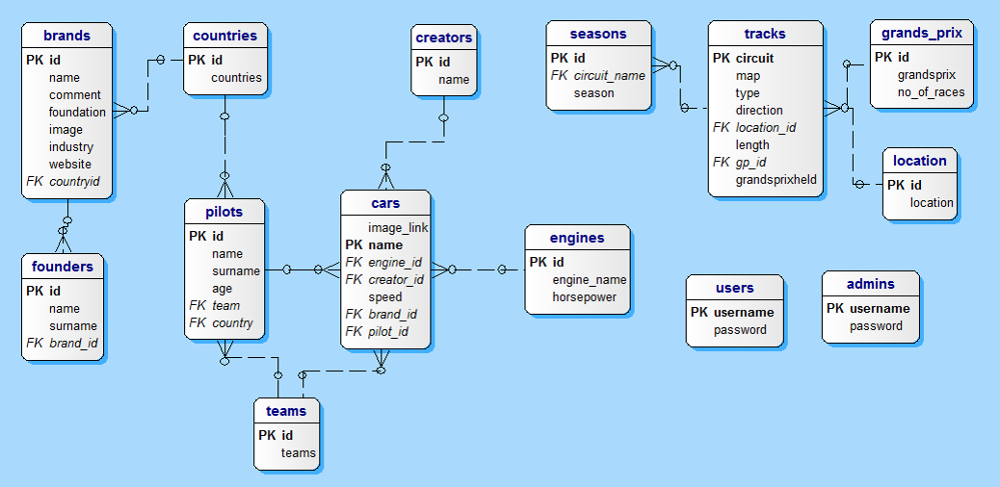

Developer Guide
===============

**Database Design**
###################

**explain the database design of your project**

**ER Diagram**

   The ER diagram of the database, created by DeZign software.

The database has different dependencies in between as it can be seen from the ER diagram. The application has a default database.
It is defined in "initialize_db.py" file as a seperate file. The other codes are inside a one consistent file. The initialization drops all the current tables accordingly (by that it is referred to using cascade while dropping).
After that tables are created and some default values are inserted. For example:

**Code**
########

**Dropping and creating table with initial values, common for all tables**

.. code-block:: python

   cursor.execute("""DROP TABLE IF EXISTS PILOTS, COUNTRIES CASCADE""")
   cursor.execute("""CREATE TABLE COUNTRIES (Id SERIAL PRIMARY KEY NOT NULL, Countries CHAR(25) Unique)""")
   cursor.execute("""CREATE TABLE PILOTS (Id SERIAL PRIMARY KEY NOT NULL, Name CHAR(25), Surname CHAR(25), Age INTEGER, Team INTEGER references TEAMS(Id), Country INTEGER references COUNTRIES(Id) )""")

**Group Members**
#################

.. toctree::

   member1
   member2
   member3
   member4
   member5
