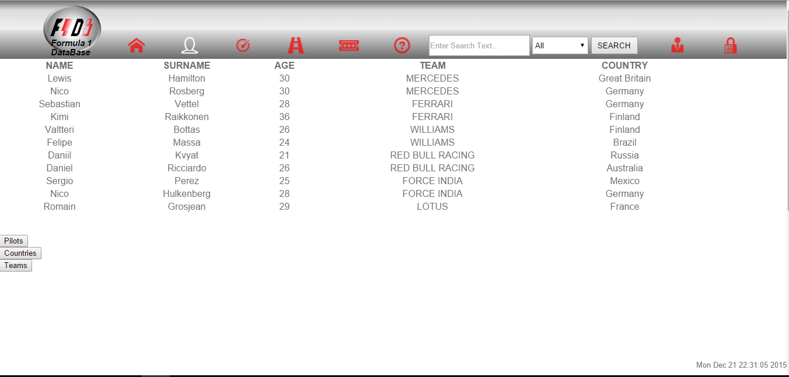
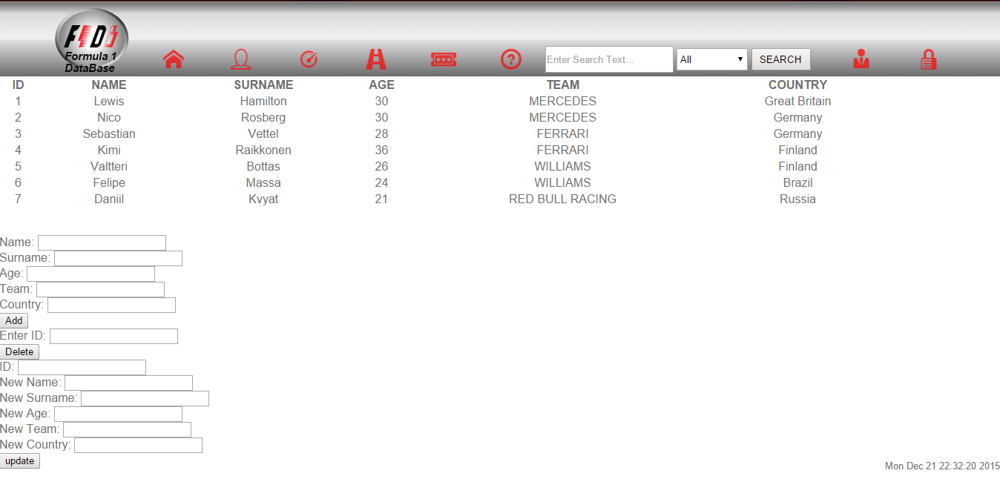
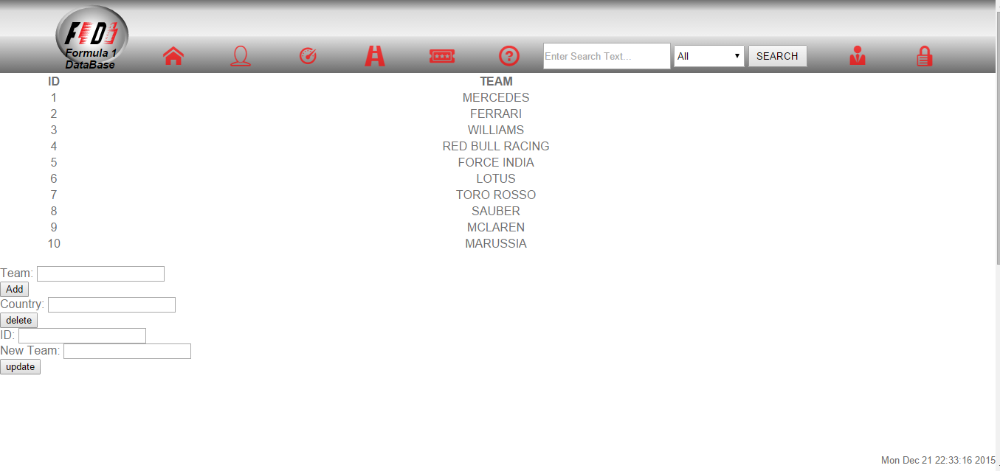
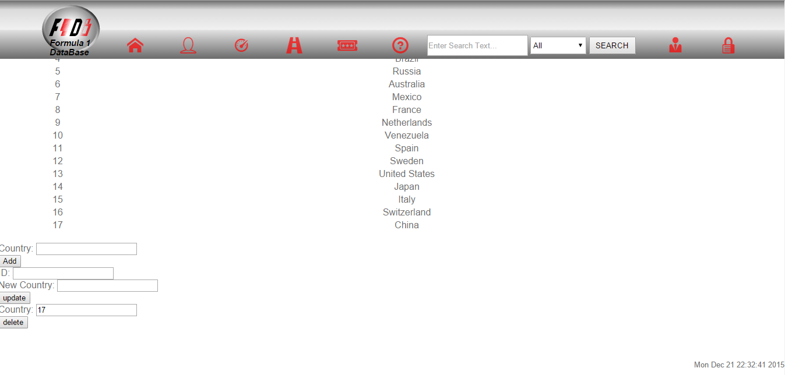

Parts Implemented by Fatih Demirel
==================================

Pilots Page
^^^^^^^^^^^

List of pilots that include team name and country name.
There are three buttons to access to add pilot page, add team page, and add country page.

Add Pilot Page
^^^^^^^^^^^^^^

You can add pilots on this page. The condition is variables for team id and country id you entered must be exist.
You can delete a pilot from list according to id of pilots.
You can update a pilot from list according to id of pilots and the condition of update operation is variables for team id and country id you entered must be exist

Add Team Page
^^^^^^^^^^^^^

You can add a new team.
You can update a existing team.
You can delete team if it does not use on other pages.

Add Country Page
^^^^^^^^^^^^^^^^

You can add a new country.
You can update a existing country.
You can delete country if it does not use on other pages.
