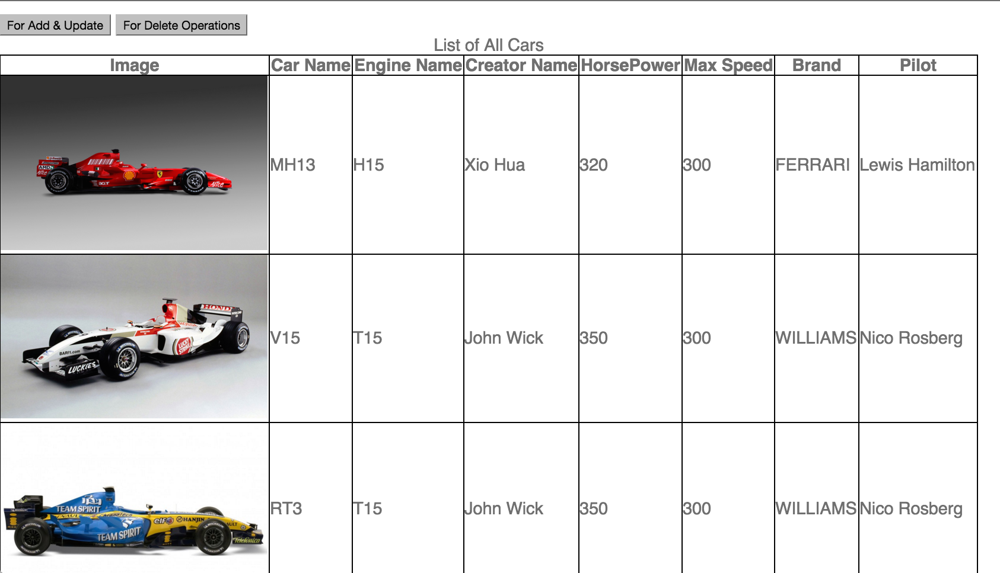
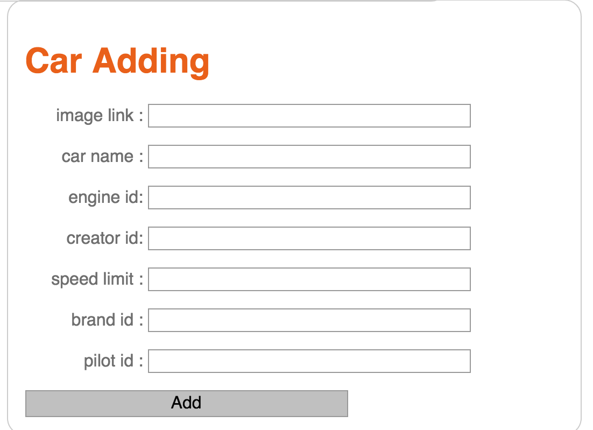
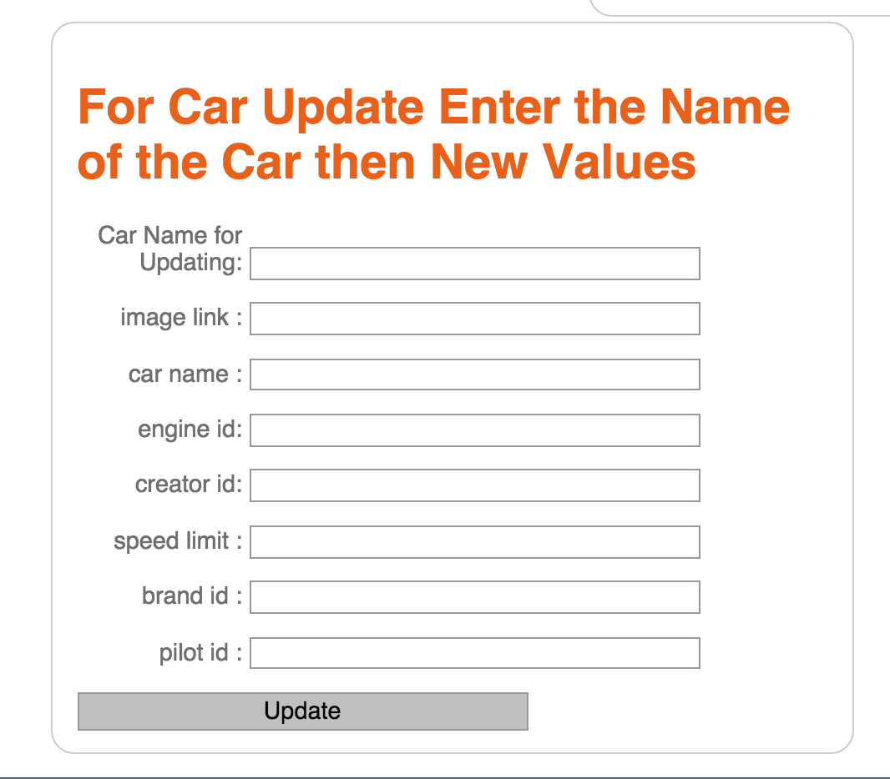
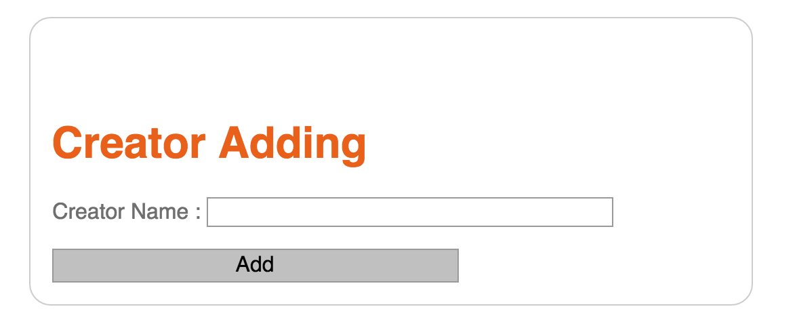
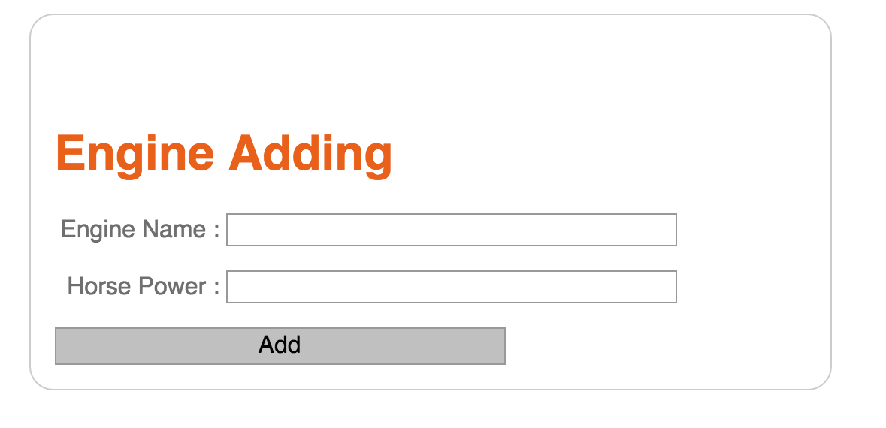
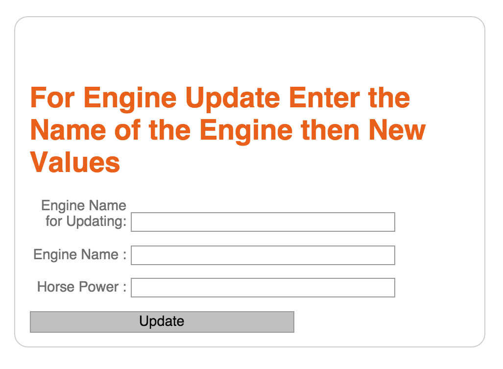
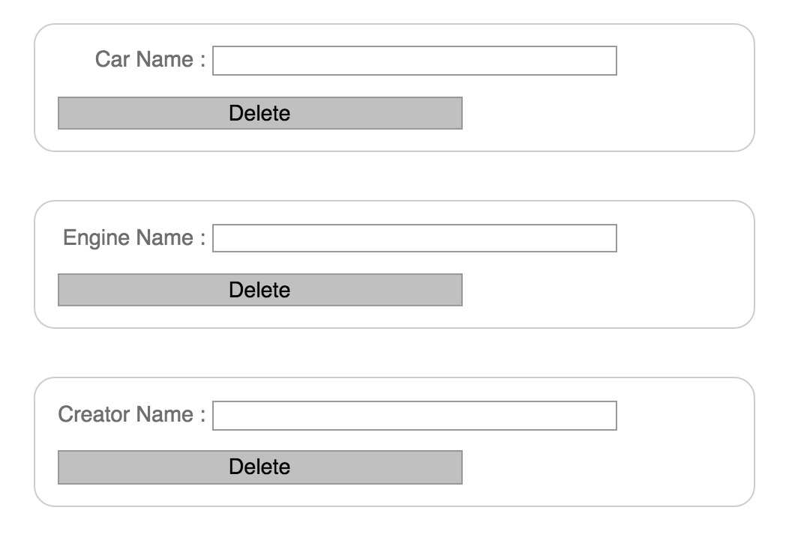

Parts Implemented by Mehmet Aygün
=================================

Cars Page
^^^^^^^^^^^

List of cars that include their names,informations about ther users,brands and creators.
There are two buttons that one of them for add&update operations and other for deleting opeations for Engines,Cars and Creator tables.
At Add&Update page you can do add and  update operations.

Add Cars Page
^^^^^^^^^^^^^^

You can add cars on this page. The condition is you have to add name of the cars.

Cars Update Page
^^^^^^^^^^^^^^

You can update a cars from list according to name of cars .

Add Creator Page
^^^^^^^^^^^^^

You can add a creator.

Creator Update Page
^^^^^^^^^^^^^

You can update a existing creator using old names.

Add Engine Page
^^^^^^^^^^^^^^^^

You can add a new engine.

Engine Update Page
^^^^^^^^^^^^^^^^

You can update a existing engine.

Delete Page
^^^^^^^^^^^^^^^^

At Delete page you can do delete operations with Engine,Creator or Cars names.

