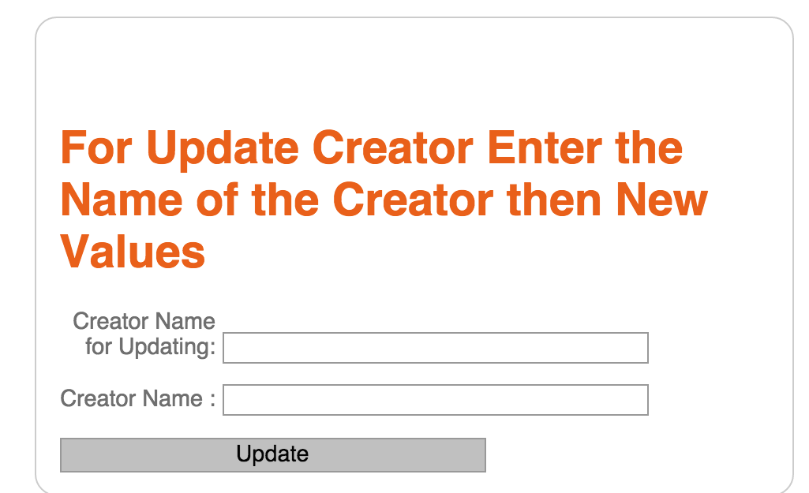

Parts Implemented by Mehmet Aygün
=================================

Cars Page
^^^^^^^^^
List of cars that include their names,informations about ther users,brands and creators.
There are two buttons that one of them for add&update operations and other for deleting opeations for Engines,Cars and Creator tables.
At Add&Update page you can do add and  update operations.

.. figure:: main.png
   :scale: 100 %
   :align: center

   main page

Add Cars Page
^^^^^^^^^^^^^

This form is subarea of car_add.html page.You can add cars on this page. The condition is you have to add name of the cars.At car adding form you can do this operation.

Cars Update Page
^^^^^^^^^^^^^^^^

This form is subarea of car_add.html page.You can update a cars from list according to name of cars .At car update form you can do this operation.

Add Creator Page
^^^^^^^^^^^^^^^^
This form is subarea of car_add.html page.You can add a creator.At creator form  you can do this operation.

Creator Update Page
^^^^^^^^^^^^^^^^^^^

This form is subarea of car_add.html page.You can update a existing creator using old names.At creator update form  you can do this operation.

Add Engine Page
^^^^^^^^^^^^^^^

This form is subarea of car_add.html page.You can add a new engine. At engine add form you can do this operation.

Engine Update Page
^^^^^^^^^^^^^^^^^^

This form is subarea of car_add.html page.You can update a existing engine.At engine update form you can do this operation.

Delete Page
^^^^^^^^^^^

At Delete page you can do delete operations with Engine,Creator or Cars names.This form is subarea of car_delete.html page.You can do this operations in delete forms.

*****************
All of the figues
*****************
.. figure:: car_add.png
   :scale: 60 %
   :align: center

   car adding form

.. figure:: car_up.png
   :scale: 60 %
   :align: center

   car updating form

.. figure:: creator_add.png
   :scale: 60 %
   :align: center

   adding creator form

   updating creator form

.. figure:: engine_add.png
   :scale: 60 %
   :align: center

   engine adding form

.. figure:: engine_up.png
   :scale: 60 %
   :align: center

   engine updating form

.. figure:: delete_all.png
   :scale: 60 %
   :align: center

   delete forms

