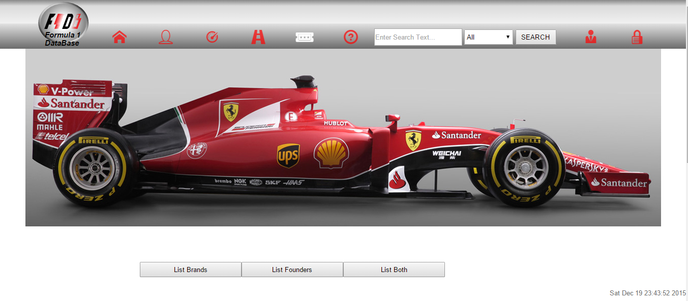
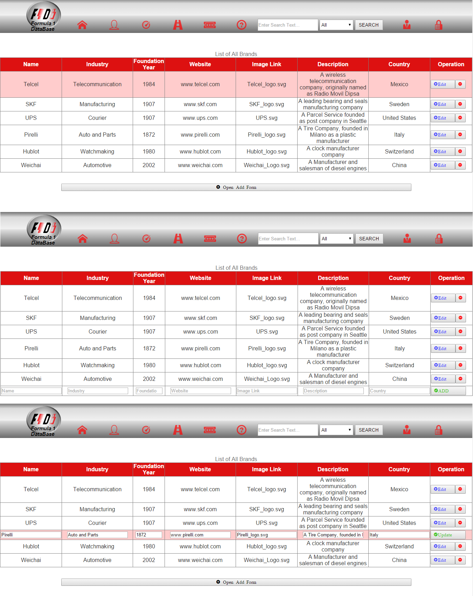
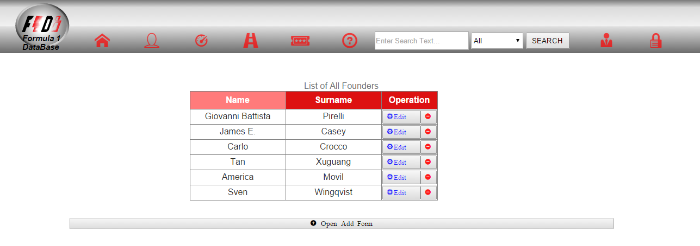
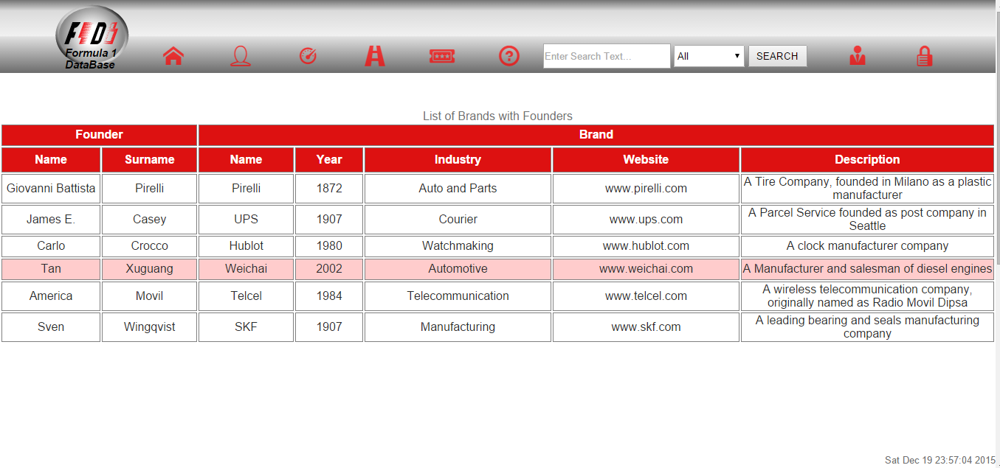
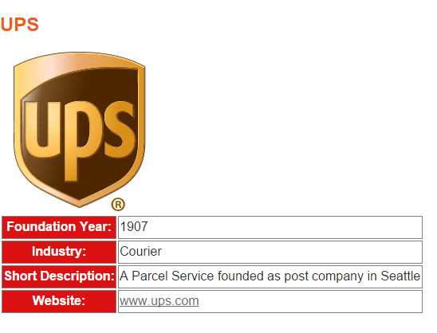

Parts Implemented by Muhammet Sadık Uğursoy
===========================================

Brands Page
^^^^^^^^^^^
In the brands page, there is a big mapped image. This image has 16 number of clickable brands on it. Each one of them redirects to a specific brand page where the image and a small information about the brand can be seen.

   The brands page with mapped image and listing buttons

.. figure:: singlebrand.png
   :scale: 80 %
   :alt: Brand page
   :align: center

   The single brand page with some information about the brand

There are 3 buttons for the brands page. Those buttons are for listing brands, founders and both of them, respectively. The corresponding pages opens when theose buttons are pressed.
List brands button lists all the brands along with edit and delete buttons. There is also an add button below which creates input fields by using javascript. Edit button also works similar. It uses
javascript for turning already filled information into input boxes filled with those information. Any change within those fields are applied if update button is pressed again. All fields are not required to be filled
except foundation year and country id.

   Listing brands (left), Adding new brand (middle), Editing a brand (right)

The operational buttons are not supposed to work when logged in as admin and never shown otherwise.

Founders Page
^^^^^^^^^^^^^
Founders table is also similar. The buttons are all the same. Adding is a bit different since it is required to enter a brand id. While adding a brand, you can simply enter the country name to add it. But this is not the case with the
founder. It has to be entered as the real brand id. This is not a feature rather it is a forgotten part that requires to be fixed. Each founder has a founder name and surname. The primary key is again an id variable since duplicate names and surnames may occur.
The brand id is placed as a foreign key so it is a necessary field to filled in. Name and surname can be NULL. This is allowed because there may be a founder with only a name or a surname (mononymous persons).

   The list of all founders

The operational buttons are not supposed to work when logged in as admin and never shown otherwise.

Brands and Founders Page
^^^^^^^^^^^^^^^^^^^^^^^^
This page has no buttons. It is only for showing the relation between brands and founders. Each relative brand and founder is printed next to next.

   The list of all founders and brands in one table

Single Brand Page
^^^^^^^^^^^^^^^^^
This page is created for visual purposes. It shows less information than the tuple of the brand has yet it shows the image of the brand. It was planned to show
the teams and pilots who uses the brand as well but it could not be implemented. The page content is dynamic.

   The information of a brand

