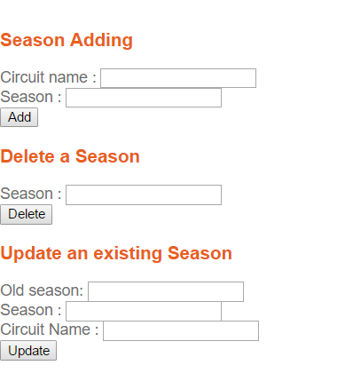

Parts Implemented by Müşerref Ebru Özaltın
==========================================

***********
Tracks Page
***********

**List of all Circuits is shown in Tracks Page.**
On the top of the page, there are 3 buttons to apply add, delete, update operations to Tracks, Grands Prix and Seasons.
The Grands Prix information of each Circuit is added from Grands Prix table.

.. figure:: tracks.png
   :scale: 75%
   :alt: Tracks Table

**List of all Seasons is shown in Tracks Page.**
A circuit can be used more than one season.

.. figure:: seasons.png
   :scale: 75%
   :alt: Season Table
   :align: center

**List of all Grands Prix is shown in Tracks Page.**

**After clicking the "CRUD operations for Tracks", the new page will be shown to apply add, delete and update operations on Tracks table.**
For adding a new track, the name of the circuit must be unique and all fields must be filled. The location should be chosen from the location ID and the Grands Prix should be chosen from the Grands Prix ID.
Instead of selecting from the ID, two list box should be used to select the name of Grands Prix and Location.
For deleting a track from the database, it is enough to enter the name of the circuit.
Updating operation is similar to adding operation. The same issues about location and Grands Prix are present here.
If a circuit has a season value, the name of the circuit couldn't be changed because of the referential integrity.
In this kind of a situation, all columns can be changed except circuit name.

.. figure:: add_track.png
   :scale: 75%
   :alt: Add Track
   :align: center

****************
Grands Prix Page
****************

**After clicking the "CRUD operations for Grands Prix", the new page will be shown to apply add, delete and update operations on Grands Prix table.**
For adding a new Grands Prix, all fields must be filled.
Deleting a Grands Prix is so easy as entering the name of the Grands Prix and click the "delete" button.
All information can be changed by updating a Grands Prix.

.. figure:: add_grandsprix.png
   :scale: 75%
   :alt: Add Grands Prix
   :align: center

************
Seasons Page
************

**After clicking the "CRUD operations for Seasons", the new page will be shown to apply add, delete and update operations on Seasons table.**
For adding a new Season, the circuit name must be exist in tracks table.
Entering the season in the field is enough for deleting a season.
For updating an existing season, the new name of the circuit must be exist in tracks table, too.

