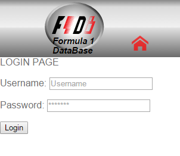
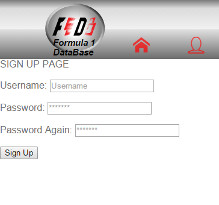

Parts Implemented by Ali Ercan
==============================

**********
Login Page
**********

You can login with this page;
There are 2 text field and 1 button at the Login page. First text field get the username of user. Second
text field get the password of user. Login button allows to user sign in her/his account.

************
Sign Up Page
************

You can sign up with this page;
There are 3 text field and 1 button at the Sign Up page. First text field get the username of user. Second
text field get the password of user. Third text field get the password again from user for confirmation.
Sign Up button allows to new user sign up her/his account. In this way, user add his/her datas to DB USERS table.

